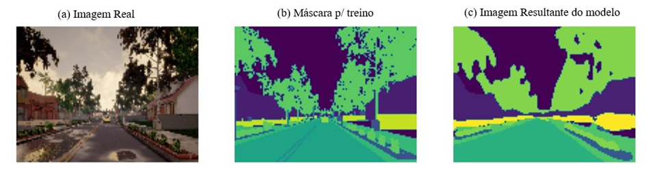
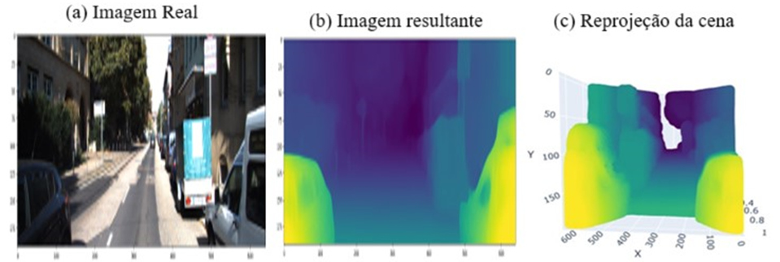
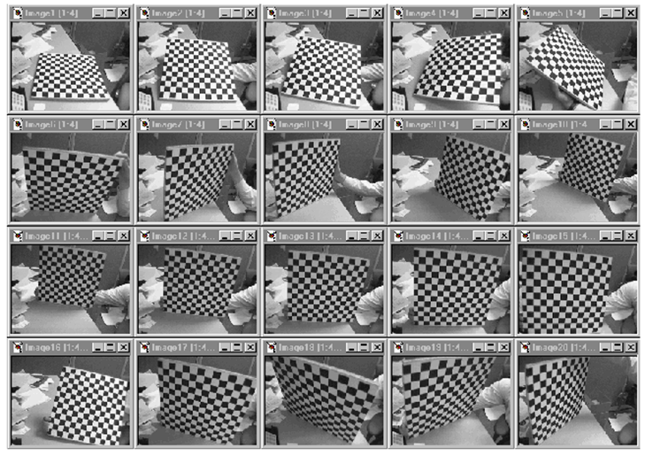
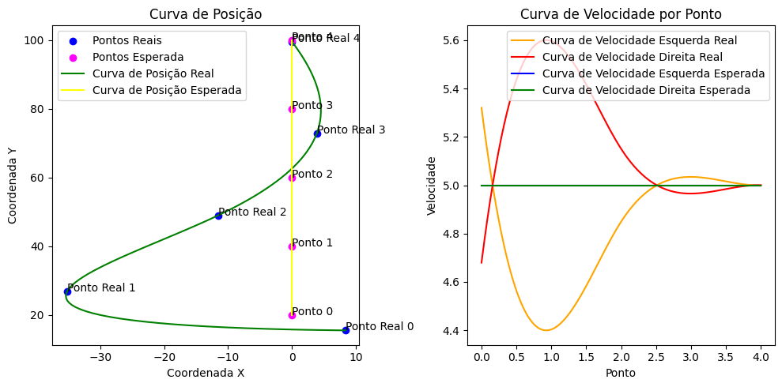

# OwlVision_MLVisions

## 1. Introdução

O OwlVision é o projeto que foi divido em três repositorios: 

    * OwlVision_AppAndroid : Aplicativo android com função de captura de imagens, interpretação das imagens e geração de trajetórias, desenvolvido majoritariamente em Java.
    * OwlVision_MLVisions: Conjunto de pipelines de processamento de imagens, como por exemplo, pipeline de geração dos modelos de estimação de profundidade e segmentação semantica, também a geração dos parametros intrinsecos da camera e outras pipelines auxiliares.
    * OwlVision_VehicleController: Serviço que recebe os dados de trajetória e faz o controle do veiculo, atráves dos atuardores (motores).
   
## 2. Resultado

### 2.1. Segmentação Semantica

### 2.2. Mapa de Profundidade com reprojeção

### 2.3. Calibração da Câmera

### 2.4. Validação dos Dados de Posição e Velocidade

## 3. Referências de Repositorio

https://github.com/nianticlabs/monodepth2
https://www.kaggle.com/code/oluwatobiojekanmi/carla-image-semantic-segmentation-with-u-net/input
https://www.linkedin.com/pulse/self-supervised-monocular-depth-estimation-santosh-sawant/?trackingId=x%2FLmRxJVRNKyh8PEOdq4lA%3D%3D 
http://robots.stanford.edu/cs223b04/JeanYvesCalib/
